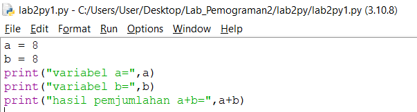

# proses / langkah-langkah praktikum 

## LATIHAN 1

### - menjalankan tulisan "hello" dilayar
### - menampilkan tulisan "saya sedang belajar pyhton" dilayar

## LATIHAN 2 

### - Menjumlahkan dua variabel bilangan menggunakan variabel a dan b 
#### - mendenifisikan variabel a dengan nilai 8
#### - mendenifisikan variabel b dengan nilai 6
#### - mencetak nilai variabel a dan b 
#### - mencetak hasil penjumlahan a+b 

## LATIHAN 3 

### - Menjalankan  IDLE 
#### - Membuat file baru dengan nama **latihan3.py** (pastikan lokasi file pada folder lab2py pada direktori anda)
#### - menggunakan funsgi **input** untuk mengambil nilai variabel dari keyboard 

## langkah-langkah menggunakan pycharm

#### - jika belum terinstal, silahkan download di https://www.jetbrains.com/pycharm/
#### - setelah selesai instalisasi, buka **pycharm** 
#### - membuat laman kerja baru dengan menekan (+) atau *create new project*

## virtual environment 

## menambahkan file baru

## menjalankan program 

